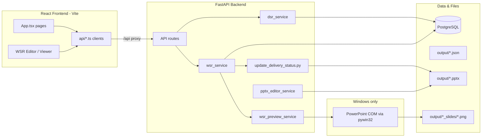

# DSR / WSR Automation

Web application for **H-E-B G10X** teams to manage Jira story intake, view **Daily Status Reports (DSR)**, and generate **Weekly Status Report (WSR)** PowerPoint decks from the official G10X template.

The system stores story snapshots in **PostgreSQL**, builds slide content from sprint/story data, and produces `.pptx` files that match G10X layout rules. The in-browser WSR editor shows slide previews rendered through **Microsoft PowerPoint on Windows** (COM automation).

---

## Table of contents

1. [How it works](#how-it-works)
2. [Architecture](#architecture)
3. [Application features](#application-features)
4. [Technology stack](#technology-stack)
5. [Prerequisites](#prerequisites)
6. [Local setup (step by step)](#local-setup-step-by-step)
7. [Running the application](#running-the-application)
8. [WSR generation pipeline](#wsr-generation-pipeline)
9. [PowerPoint: two different dependencies](#powerpoint-two-different-dependencies)
10. [Deployment guide](#deployment-guide)
11. [API reference](#api-reference)
12. [Project structure](#project-structure)
13. [Database](#database)
14. [CLI and automation scripts](#cli-and-automation-scripts)
15. [Environment variables](#environment-variables)
16. [Troubleshooting](#troubleshooting)
17. [What not to commit](#what-not-to-commit)

---

## How it works

```
Rovo AI / JSON intake  →  PostgreSQL  →  ppt_content.json  →  WSR_YYYY-MM-DD_YYYY-MM-DD.pptx
      (import API)         (stories,         (slide text)            (G10X template)
                            sprints)
```

1. **Import** — Story data from Rovo AI (or manual JSON) is loaded into `projects`, `sprints`, and `jira_stories`.
2. **DSR** — For a given date, the UI shows per-track story boards filtered by `snapshot_date`.
3. **WSR content** — For a Monday–Friday report window, qualifying sprints (date overlap) are grouped by delivery track; Highlights are built from Jira stories; Key Activities are placeholders for manual BSA entry.
4. **WSR deck** — `update_delivery_status.py` copies the G10X template, fills slides, removes empty delivery slides, reflows the Index slide, and saves the `.pptx`.
5. **Preview (optional)** — Slide PNGs are exported via PowerPoint COM for the in-browser editor/viewer.
6. **Evaluation / correction (optional)** — Separate CLI tools check layout rules and can run vision-based repair loops.

---

## Architecture



| Layer | Role |
|-------|------|
| **Frontend** (`src/`) | React 18 + Vite + Tailwind; single-page app with sidebar navigation (no React Router). |
| **Backend** (`backend/Jira-Automation/`) | FastAPI on port 8000; business logic, WSR jobs, PPT build subprocess. |
| **PostgreSQL** | Story snapshots, sprints, projects. |
| **`output/`** | Generated JSON, `.pptx`, text previews, PNG slide images. |
| **G10X template** | Master `.pptx` under `backend/Jira-Automation/templates/`. |

---

## Application features

Navigation is driven by `page` state in `src/app/App.tsx` (not URL routes).

| Page | ID | Description |
|------|-----|-------------|
| **Intake** | `intake` | Upload Rovo JSON or paste story data; import into PostgreSQL. |
| **Story Board** | `complete-stories` | Browse, filter, edit stories; regenerate AI titles. |
| **View DSR** | `view-dsr` | Daily status by track and date (`snapshot_date`). Sidebar hides LOCO and Pricing (PRC); keeps PRICE. |
| **Generate WSR** | `wsr-generate` | Pick week range, queue background job, edit deck in browser, download `.pptx`. |
| **View WSR** | `wsr-view` | List previously generated WSR weeks and open viewer. |

### WSR Index slide rules

Index compaction (delivery tracks, **Matters of Attention**, **Team Allocation**) lives in:

`backend/Jira-Automation/scripts/update_delivery_status.py`

Key symbols: `INDEX_ENTRY_RULES`, `reflow_index_slide`, `_index_slot_assignments_for_populated_week`, `sync_index_slide_numbers`.

Non-delivery entries (Matters / Team) use `delivery_only=False` so they appear on the Index even when their slide titles do not contain `"Delivery status"`.

### Key Activities (next week)

- **Highlights** are auto-filled from Jira story data.
- **Key Activities for next week** are **not** auto-populated from the database by default.
- `ppt_content_builder.py` sets `key_activities: []`; the PPT builder leaves placeholder rows for manual BSA entry in PowerPoint or via the in-browser editor.

---

## Technology stack

### Frontend

- React 18, TypeScript, Vite 6
- Tailwind CSS 4, Radix UI, Lucide icons
- Konva / react-konva for WSR slide canvas overlays
- Dev proxy: `/api` → `http://127.0.0.1:8000` (`vite.config.ts`)

### Backend

- Python 3.11+, FastAPI, Uvicorn
- SQLAlchemy 2, Alembic, PostgreSQL
- `python-pptx` — build and patch `.pptx` without PowerPoint
- `pywin32` — PowerPoint COM (Windows only, optional for previews)
- Google Gemini / Azure OpenAI / OpenAI — optional LLM for titles and vision layout review

---

## Prerequisites

| Requirement | Required for |
|-------------|--------------|
| **Node.js 18+** and npm | Frontend dev server |
| **Python 3.11+** | Backend API and scripts |
| **PostgreSQL 14+** | Story storage (local, Docker, or RDS) |
| **Microsoft PowerPoint** (Windows) | In-browser WSR slide **previews** and editor backgrounds |
| **GEMINI_API_KEY** (or other LLM) | AI story titles, optional vision evaluation |

---

## Local setup (step by step)

### 1. Clone the repository

```powershell
cd DSR_WSR_AUTOMATION
```

### 2. PostgreSQL

**Option A — Docker (recommended)**

```powershell
cd backend\Jira-Automation
copy .env.docker.example .env.docker
# Edit POSTGRES_PASSWORD in .env.docker
docker compose --env-file .env.docker up -d
```

**Option B — Local PostgreSQL**

Create database `dsr_wsr_db` and note host, port, user, password.

### 3. Backend setup

```powershell
cd backend\Jira-Automation

py -3 -m venv .venv
.\.venv\Scripts\Activate.ps1
pip install -r requirements.txt

copy .env.example .env
# Edit DATABASE_URL and GEMINI_API_KEY in .env

python scripts\init_db.py
python -m alembic upgrade head
```

Import sample or Rovo data:

```powershell
python scripts\seed_from_rovo.py "path\to\rovo-response.json"
# Or reset + seed from bundled JSON:
python scripts\reset_and_seed_stories.py data\july27_stories.json
```

### 4. Frontend setup

From the **repository root**:

```powershell
cd ..   # back to DSR_WSR_AUTOMATION root if needed
npm install
```

### 5. Start both servers

**Backend** (from `backend/Jira-Automation`):

```powershell
python -m uvicorn app.main:app --reload --host 127.0.0.1 --port 8000
```

**Frontend** (from repo root):

```powershell
npm run dev
```

Open the URL shown by Vite (typically `http://localhost:5173`). The frontend proxies API calls to the backend.

Verify backend health: `http://127.0.0.1:8000/health`

---

## Running the application

### Typical weekly WSR workflow

1. **Intake** — Import latest Rovo export so `jira_stories` has current `snapshot_date` rows.
2. **Generate WSR** — Select Monday–Friday week; click generate.
3. Wait for job completion (UI polls `GET /api/wsr/status`).
4. Review slides in the editor; edit text if needed; **Sync to PowerPoint** applies changes to the real `.pptx`.
5. **Download** the final deck or open it locally in PowerPoint for Key Activities and final polish.

### WSR week output files

For week `2026-07-27` to `2026-07-31`:

| File | Purpose |
|------|---------|
| `output/WSR_2026-07-27_2026-07-31.json` | Slide content JSON |
| `output/WSR_2026-07-27_2026-07-31_preview.txt` | Human-readable preview |
| `output/WSR_2026-07-27_2026-07-31.pptx` | Generated PowerPoint |
| `output/WSR_2026-07-27_2026-07-31_slides/slide_NN.png` | COM-exported preview images |
| `output/WSR_2026-07-27_2026-07-31_editor.json` | Editor document cache |

---

## WSR generation pipeline

When `POST /api/wsr/generate` is called:

1. **Background job** starts (`wsr_job_service.py`).
2. **`build_ppt_content`** — Queries PostgreSQL; builds per-track slides and sprint sections.
3. **Writes** JSON + text preview to `output/`.
4. **`build_ppt_deck`** — Subprocess: `python scripts/update_delivery_status.py --content ... --output ...`
5. **`export_wsr_slide_previews`** — Attempts PNG export (COM); failures are logged but do not fail the job.
6. Job status becomes `completed`; result includes `download_url` and `preview_slides`.

Sprint selection: sprints whose date range **overlaps** the WSR window are included. Projects with no qualifying content are omitted from the deck and Index.

---

## PowerPoint: two different dependencies

This is critical for deployment.

| Capability | Technology | Needs installed PowerPoint? |
|------------|------------|----------------------------|
| **Build `.pptx`** | `python-pptx` in `update_delivery_status.py` | **No** — works on Linux/macOS |
| **In-browser slide previews** | `ComSlideRendererBackend` (`win32com` + PowerPoint) | **Yes** — Windows only |
| **Editor sync previews** | Same COM path after `POST /api/wsr/editor/sync` | **Yes** |
| **Download `.pptx`** | Reads file from `output/` | **No** |

### What works without PowerPoint on the server

- `POST /api/wsr/generate` completing successfully
- `GET /api/wsr/download` returning the `.pptx`
- Editor loading **text** from `python-pptx` parsing (without slide background images)

### What breaks without PowerPoint on the server

- Blank or missing thumbnails in WSR viewer/editor
- `GET /api/wsr/preview/slides` returning errors
- Vision/format repair CLI tools that export slide PNGs

### Local development (your current setup)

Windows + installed PowerPoint + `pywin32` matches full functionality: generate, preview, edit, sync, download.

---

## Deployment guide

### Scenario A: Linux / container cloud (Azure App Service, ECS, etc.)

| Feature | Expected result |
|---------|-----------------|
| API + DSR + story intake | Works |
| WSR `.pptx` generation | Works |
| WSR download | Works |
| WSR in-app previews / editor backgrounds | **Degraded or broken** |

**Mitigation:** Treat WSR as **download-only** in production, or add a Windows worker for preview export.

### Scenario B: Windows Server with PowerPoint

| Feature | Expected result |
|---------|-----------------|
| Full WSR flow | Works like local dev |

**Caveats:**

- Office licensing for the service account
- COM automation permissions (run as interactive user or configured DCOM)
- Close file locks — do not open the same `.pptx` in PowerPoint while the API writes it
- `pywin32` must be installed (`requirements.txt` installs it only on `win32`)

### Scenario C: Hybrid

- **Linux:** FastAPI + PostgreSQL + `python-pptx` generation
- **Windows VM:** Optional preview export service, or users download `.pptx` and edit in desktop PowerPoint

### Production checklist

- [ ] PostgreSQL reachable; `DATABASE_URL` set
- [ ] `templates/G10X H-E-B WSR Sustainment 05 June 2026 .pptx` deployed
- [ ] Writable `output/` directory (persistent volume recommended)
- [ ] `GEMINI_API_KEY` or LLM credentials if using AI titles
- [ ] CORS / reverse proxy: frontend static files + `/api` to Uvicorn
- [ ] If previews required: Windows + PowerPoint + pywin32
- [ ] Do not commit `.env` with secrets

### Frontend production build

```powershell
npm run build
# Serve dist/ via nginx, S3+CloudFront, or static hosting; proxy /api to backend
```

### Backend production (example)

```powershell
uvicorn app.main:app --host 0.0.0.0 --port 8000
# Use gunicorn/uvicorn workers behind a reverse proxy in real deployments
```

---

## API reference

Base URL in dev: `http://127.0.0.1:8000`. Frontend uses relative `/api/...` via Vite proxy.

### Health

| Method | Path | Description |
|--------|------|-------------|
| GET | `/health` | `{"status":"ok"}` |

### DSR

| Method | Path | Description |
|--------|------|-------------|
| GET | `/api/teams/{team_name}/tracks` | Tracks for sidebar |
| GET | `/api/dsr/tracks/{project_key}?report_date=` | DSR for track on date |

### Stories

| Method | Path | Description |
|--------|------|-------------|
| GET | `/api/stories` | List stories (`snapshot_date`, filters) |
| POST | `/api/stories` | Create story |
| PUT | `/api/stories` | Upsert / save |
| GET | `/api/stories/track/{track_id}` | Stories by track |
| GET | `/api/stories/track/{track_id}/dsr` | DSR-filtered stories |
| POST | `/api/stories/{jira_key}/regenerate-title` | AI title suggestions |
| PUT | `/api/stories/{jira_key}` | Update by key |

### WSR

| Method | Path | Description |
|--------|------|-------------|
| GET | `/api/wsr/weeks` | List generated WSR weeks |
| GET | `/api/wsr/week?start_date=&end_date=` | Load existing week metadata |
| POST | `/api/wsr/generate` | Queue generation (202) |
| GET | `/api/wsr/status?start_date=&end_date=` | Poll job status |
| GET | `/api/wsr/download?start_date=&end_date=` | Download `.pptx` |
| GET | `/api/wsr/preview/slides?start_date=&end_date=` | List preview slides |
| GET | `/api/wsr/preview/image?start_date=&end_date=&slide_index=` | PNG for one slide |
| GET | `/api/wsr/editor/deck?start_date=&end_date=` | Editor JSON + preview URLs |
| PUT | `/api/wsr/editor/deck` | Save editor JSON |
| POST | `/api/wsr/editor/sync` | Apply edits to `.pptx` + refresh PNGs |
| POST | `/api/wsr/editor/export` | Export edited deck as download |

**Generate flow:** `POST /api/wsr/generate` → poll `GET /api/wsr/status` until `status=completed` → use `download_url` or open editor.

---

## Project structure

```
DSR_WSR_AUTOMATION/
├── README.md                 # This file
├── package.json              # Frontend dependencies
├── vite.config.ts            # Vite + /api proxy
├── src/
│   ├── main.tsx
│   ├── app/App.tsx           # Main shell, intake, DSR, story board
│   ├── api/
│   │   ├── stories.ts        # Story CRUD + import
│   │   ├── dsr.ts            # DSR tracks + filters
│   │   └── wsr.ts            # WSR generate, editor, download
│   └── components/
│       ├── WSRReportPanel.tsx    # Generate WSR UI
│       ├── ViewWSRPage.tsx       # WSR week list
│       ├── WSRPptViewer.tsx      # Slide viewer
│       └── ppt-editor/           # In-browser PPT editor (Konva)
│           ├── WSRPptEditor.tsx
│           ├── SlideCanvas.tsx
│           └── ...
└── backend/Jira-Automation/
    ├── README.md             # CLI-focused backend docs
    ├── app/
    │   ├── main.py           # FastAPI app
    │   ├── api/routes/       # dsr, stories, wsr
    │   ├── services/         # wsr_service, dsr_service, pptx_editor, previews
    │   ├── rendering/        # COM slide renderer (Windows)
    │   └── models/           # SQLAlchemy models
    ├── scripts/
    │   ├── update_delivery_status.py   # PPT builder (python-pptx)
    │   ├── generate_ppt_content.py     # CLI full pipeline
    │   ├── seed_from_rovo.py
    │   └── evaluate_ppt_format.py      # Layout evaluation
    ├── templates/            # G10X master .pptx
    ├── output/               # Generated artifacts (gitignored)
    ├── data/                 # Sample JSON seeds
    └── requirements.txt
```

---

## Database

### Tables (summary)

| Table | Purpose |
|-------|---------|
| `projects` | Jira project / delivery track |
| `sprints` | Sprint name, start/end dates, status |
| `jira_stories` | Story fields; FK to project and sprint; `snapshot_date` for DSR |

Full schema: `backend/Jira-Automation/sql/schema.sql`

### Useful maintenance commands

From `backend/Jira-Automation` with venv active:

**Wipe stories and sprints only:**

```powershell
python -c "from sqlalchemy import text; from app.database import SessionLocal; db = SessionLocal(); s = db.execute(text('DELETE FROM jira_stories')).rowcount; sp = db.execute(text('DELETE FROM sprints')).rowcount; db.commit(); print(f'Deleted {s} stories, {sp} sprints'); db.close()"
```

**Reset and re-import from JSON:**

```powershell
python scripts\reset_and_seed_stories.py data\july27_stories.json
```

---

## CLI and automation scripts

For headless deck builds, evaluation, and vision repair **without the web UI**, see:

**[backend/Jira-Automation/README.md](backend/Jira-Automation/README.md)**

Highlights:

```powershell
# Full CLI pipeline
python scripts\generate_ppt_content.py --start-date 2026-07-27 --end-date 2026-07-31

# Build PPT from existing JSON
python scripts\update_delivery_status.py --content output\ppt_content.json --output output\HEB_Delivery_Status.pptx

# Format evaluation
python scripts\evaluate_ppt_format.py --ppt output\HEB_Delivery_Status.pptx --mode deterministic
```

---

## Environment variables

Copy `backend/Jira-Automation/.env.example` to `.env`.

| Variable | Purpose |
|----------|---------|
| `DATABASE_URL` | PostgreSQL connection string |
| `POSTGRES_*` | Used by `init_db.py` |
| `GEMINI_API_KEY` | Google AI Studio (primary LLM) |
| `GEMINI_MODEL` / `GEMINI_VISION_MODEL` | Model names |
| `LLM_PROVIDER` | `auto`, `gemini`, `azure`, `openai` |
| `WSR_LLM_MAX_CALLS_PER_MINUTE` | Rate limit for title generation |
| `AZURE_OPENAI_*` | Optional Azure OpenAI fallback |
| `OPENAI_API_KEY` | Optional OpenAI fallback |

> If the database password contains `@`, URL-encode it in `DATABASE_URL` (`@` → `%40`).

---

## Troubleshooting

| Issue | Likely cause | Fix |
|-------|--------------|-----|
| Frontend API errors | Backend not running | Start Uvicorn on port 8000 |
| `Connection refused` to DB | PostgreSQL down / wrong `.env` | Start Docker DB or check credentials |
| WSR generates but no thumbnails | No PowerPoint / not Windows | Expected on Linux; download `.pptx` still works |
| `PermissionError` on `.pptx` | File open in PowerPoint | Close deck or use different output path |
| Stale WSR previews in UI | Cached PNGs | Regenerate WSR; previews use cache-busting `&v=` param |
| Index missing Matters / Team | Old deck or old code | Regenerate after backend update |
| No stories for WSR week | Date range / snapshot | Widen dates; re-import Rovo data |
| `win32com` errors | pywin32 or PowerPoint missing | Install Office + `pip install pywin32` on Windows |
| Vision / AI errors | Missing API keys | Set `GEMINI_API_KEY` or Azure/OpenAI vars |

---

## What not to commit

- `.env` files (credentials)
- `.venv/`
- `node_modules/`
- `backend/Jira-Automation/output/` (generated decks and PNGs)
- Local Rovo exports with real production data

---

## License

Internal H-E-B / G10X training project.

---

## Further reading

- [Backend CLI & evaluation docs](backend/Jira-Automation/README.md)
- G10X template: `backend/Jira-Automation/templates/G10X H-E-B WSR Sustainment 05 June 2026 .pptx`
- Index / PPT layout logic: `backend/Jira-Automation/scripts/update_delivery_status.py`
- Format rulebook: `backend/Jira-Automation/app/constants/ppt_format_rulebook.json`
  