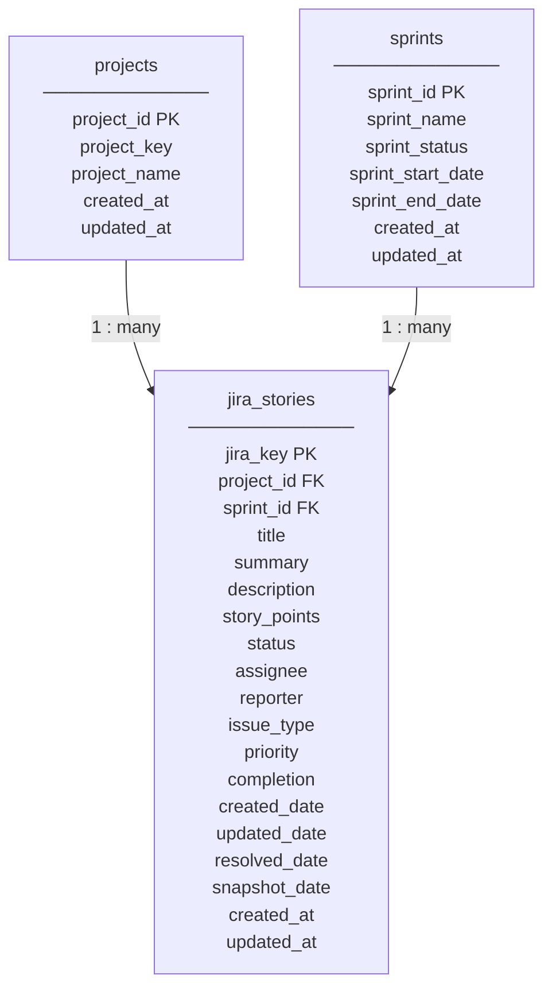

# DSR/WSR Automation DB — ER Diagram

Open this file and press **`Ctrl+Shift+V`** to preview (needs **Markdown Preview Mermaid Support**).

---

## Simple ER diagram (3 tables)



---

## Relationships

| From | To | Link |
|------|----|------|
| **projects** | **jira_stories** | `jira_stories.project_id` → `projects.project_id` |
| **sprints** | **jira_stories** | `jira_stories.sprint_id` → `sprints.sprint_id` |

- Each **story** belongs to one **project** (required).
- Each **story** can belong to one **sprint** (optional).
- **Project** and **sprint** names are stored once in lookup tables — no duplication on every story row.

---

## Example values

**projects:** LOC → LOCO, COST → Cost Core Service, GSS, WNF, PHRM, SUP, SPUR, PRC

**sprints:** `Nacogdoches - 248`, `Q2.13FY26 Eridanus` — `sprint_status`: `inprogress` or `ended`

---

## Filter examples

```sql
-- Stories for project LOCO
SELECT js.jira_key, js.summary, js.status
FROM jira_stories js
JOIN projects p ON p.project_id = js.project_id
WHERE p.project_name = 'LOCO';

-- Stories in an active sprint
SELECT js.jira_key, s.sprint_name, js.summary
FROM jira_stories js
JOIN sprints s ON s.sprint_id = js.sprint_id
WHERE s.sprint_status = 'inprogress';
```
